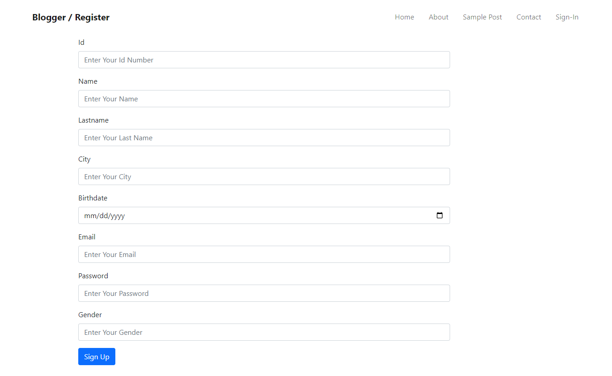
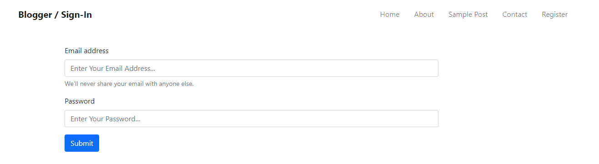
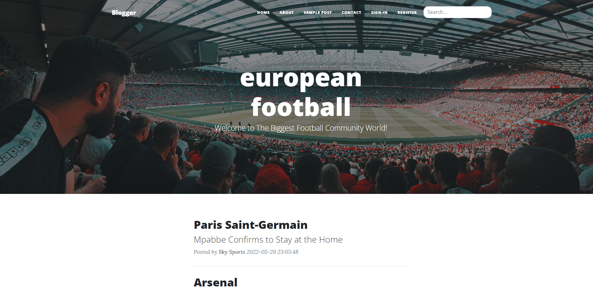
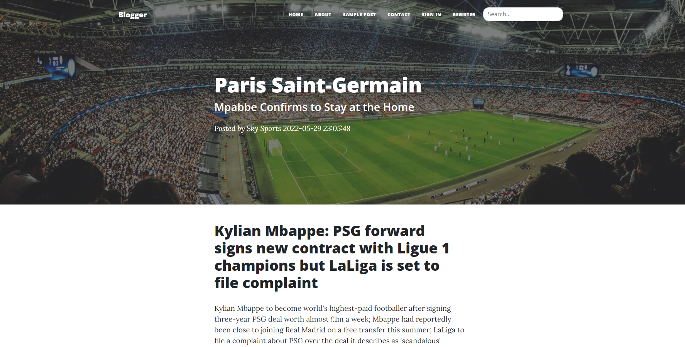
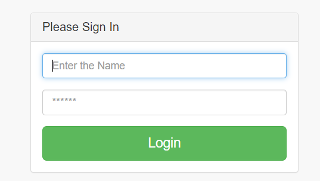
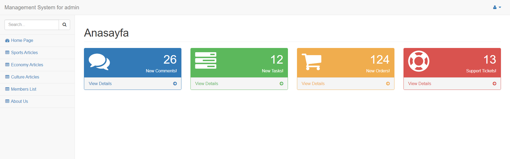
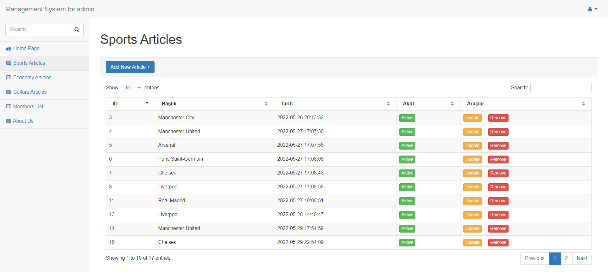
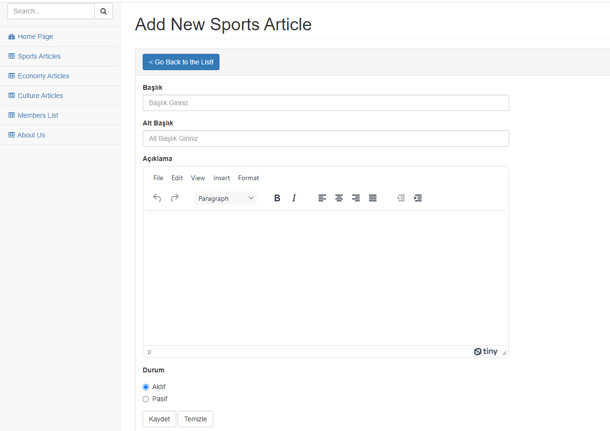
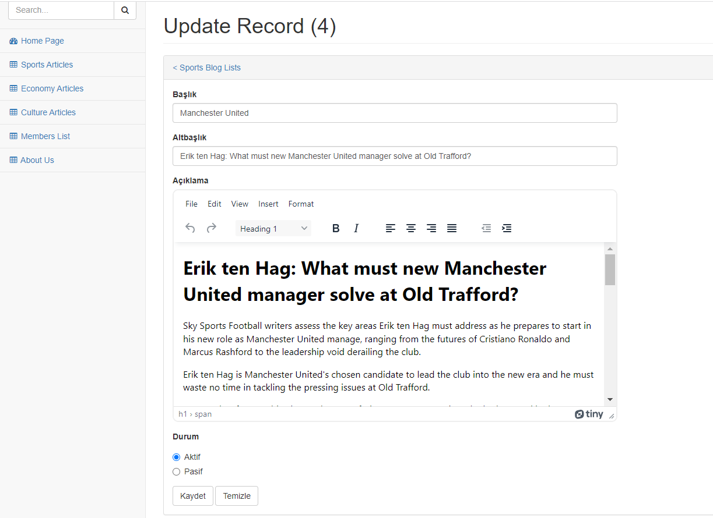
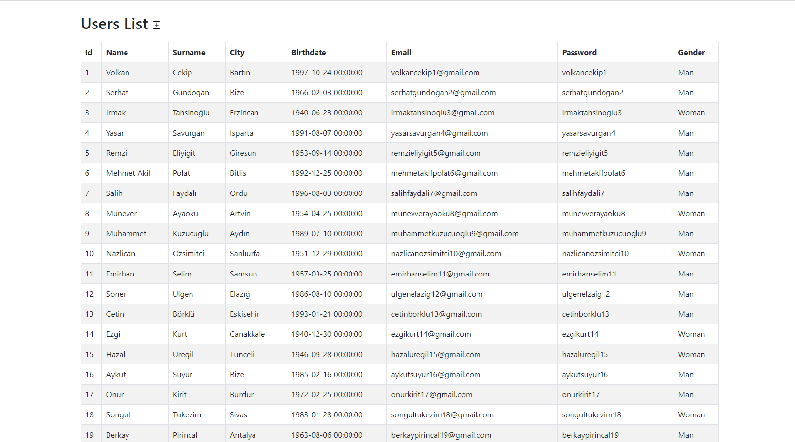

# Blog Community World!   

### Contents
* [About The Project](#about)
* [About Databases](#databases)
* [Technologies](#technologies)
* [Customer Register and Sign-In](#register-sign-in)
* [Sports Articles Homepage](#sports-homepage)
* [A Sport Article Detail](#sports-detail)
* [Admin Sign-In Panel](#admin-sign-in)
* [Admin Panel Homepage](#admin-homepage)
* [Admin Panel Sports Articles General View](#admin-sports-general)
* [Admin Panel Add New Sports Articles](#admin-sports-add)
* [Admin Panel Update Sports Articles](#admin-sports-update)
* [Admin Panel Remove and Activ Operations For Sports Articles](#admin-asia-remove-activ)
* [Admin Panel - Show Members](#admin-members)

### About The Project 

- ##### This is a dynamic web application publishing new articles about daily topics, and also breaking news especially on the subjects of sports and culture.

- ##### Users can register and sign-in the application.

- ##### Breaking news are published by the admin.

- ##### Any news can be added, updated, deleted, and managed by admin panel based on database operations.

- ##### Users can read whatever they want, and search the topics they would like to read.

### About Databases 
- ##### Database: customers --> table: customersinfo
##### All the records about the users of the application are kept here. Admin can see who registered the application to read new articles, using admin panel.

- ##### Database: articles --> tables: sports, culture
##### All the records about new articles and blogs are kept here. Admin can add new article, update an existing one, delete, make pasive or aktive, using admin panel. And all these operations are provided from MySQL database.

### Technologies That Is Used 

- ##### The user interface of the project is designed, conceived and completed by HTML5 - CSS3 and Bootstrap. 

- ##### In order to make the application to gain dynamic attributes, PHP - PDO concept has been used. So that we can build the bridge between web application and our database system. The connection between the site and database has been provided by PHP - PDO and MySql technologies. So all the data is stored, kept and managed by MySql.

### Customer Register and Sign-In 
- ##### Users should reigster and sign-in in order to read articles. This sign-in / register operations is provided by user interface at the front-end and a database system at the back-end. 

- #### Register:

- #### Sign-In:

### Sports Articles Homepage 

### A Sport Article Detail 

### Admin Sign-In Panel 

### Admin Panel Homepage 

### Admin Panel Sports Articles General View 

### Admin Panel Add New Sports Articles 

### Admin Panel Update Sports Articles 

### Admin Panel Remove and Activ Operations For Sports Articles 

### Admin Panel - Show Members 

